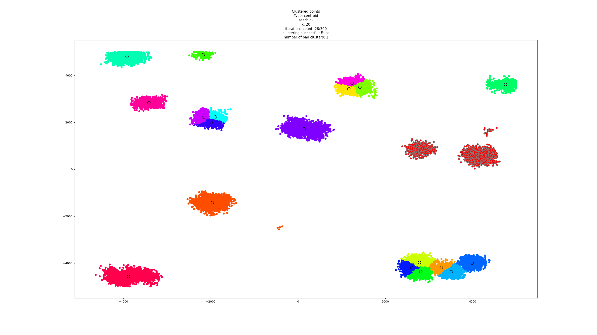
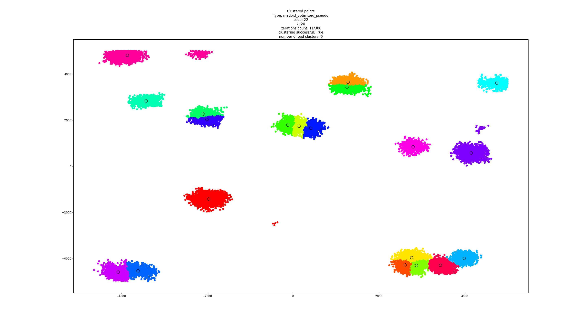
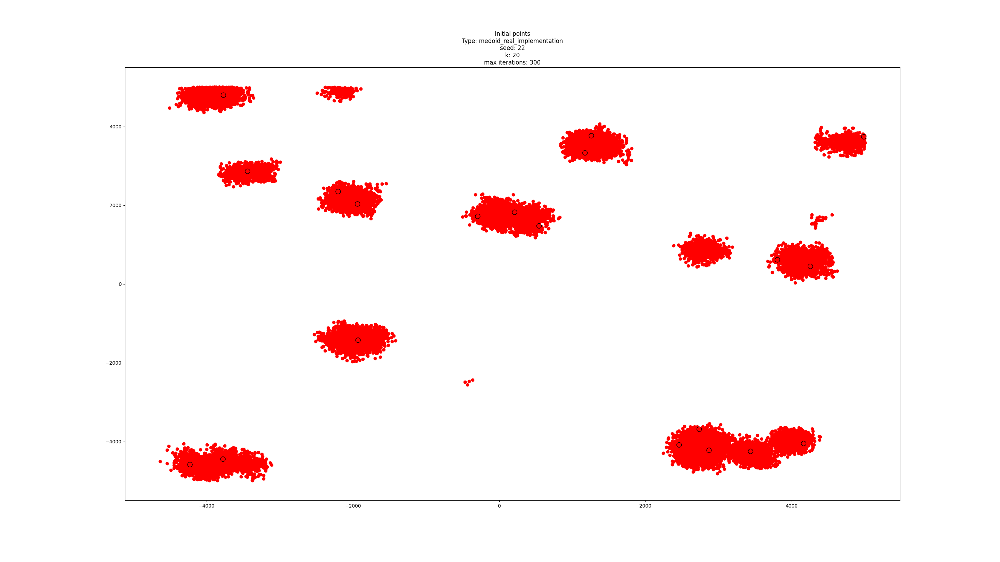
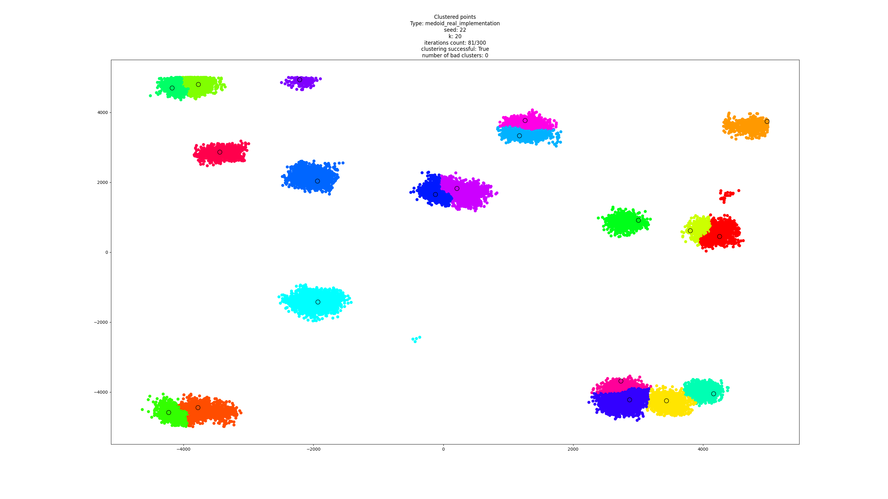
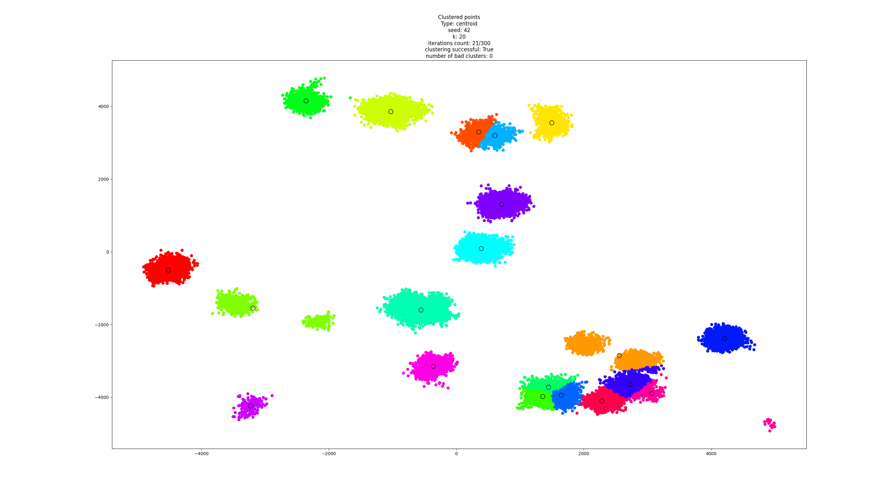
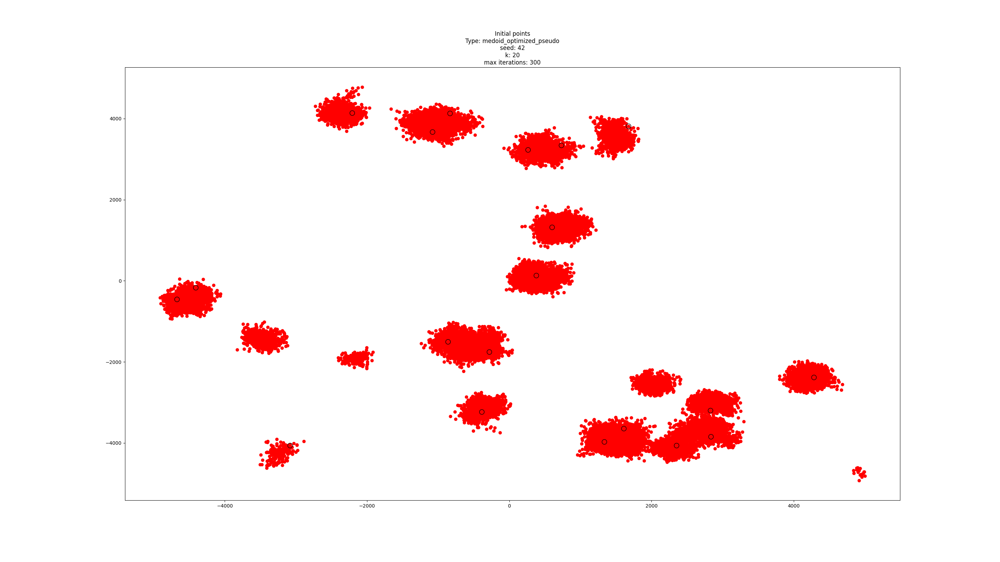
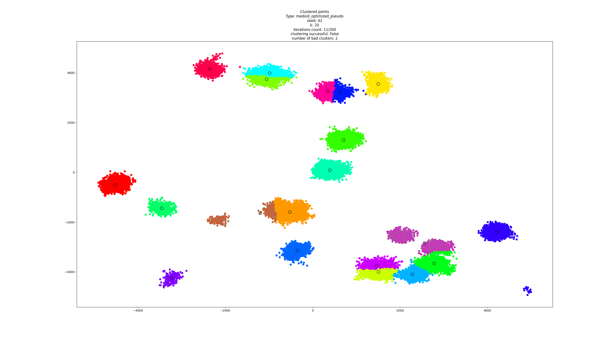
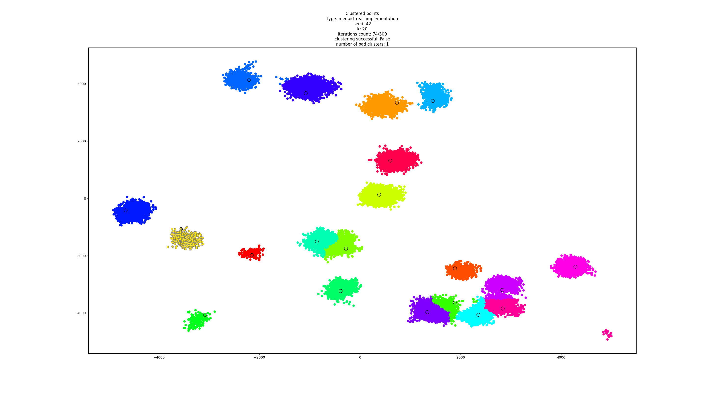

# UI - Umelá inteligencia
## Zadanie č.2 - Klasifikácia a zhlukovanie (klastrovanie 2b)

### Autor: Marek Čederle
#### AIS ID: 121193
### Cvičiaci: Mgr. Matej Pecháč PhD.
#### Cvičenie: Štvrtok 10:00


## Úvod

### Ako spustiť program (primárne Windows)

Na spustenie programu je potrebné nainštalovať "dependencies" pomocou príkazu nasledujúceho prikazu (treba byť v adresári, kde sa nachádza súbor [requirements.txt](../requirements.txt) resp [main.py](../main.py)):

`> pip install -r requirements.txt`

Program bude ukladať "ploty" (obrázky) do priečinka `./plots/`. Ak neexistuje, tak ho treba vytvoriť.

Je potrebné mať nainštalovaný Python 3. Osobne som používal verziu 3.12.7, ale malo by to fungovať pre verziu 3.9 a vyššie.
Je potrebné aby sme mali všetky python súbory v jednom adresáry. Otvoríme si príkazový riadok v adresári so súbormi spustíme program [main.py](../main.py). Zadáme nasledujúci príkaz:

`> python ./main.py`

alebo

`> python3 ./main.py`

Po spustení program vypíše tieto inštrukcie pre pokračovanie:

Automatický vstup:
```
Enter choice:
 0 - for EXIT
 1 - k-means centroid
 2 - k-means medoid (optimized - pseudo implementation)
 3 - divisive clustering centroid
 4 - k-means medoid (real implementation)
```

Následne je treba si vybrať, ktorý algoritmus chceme spustiť. Po vybratí sa zobrazia ďalšie inštrukcie. Medzi ne v závislosti od výberu algoritmu patrí zadanie:
- `seed` - seed pre generovanie náhodných čísel na zachovanie reprodukovateľnosti
- `k` - (počet zhlukov)
- počet iterácií


### Opis problému

Máme vygenerovať 20 + 40000 bodov, ktoré následne máme zhlukovať do k zhlukov podľa troch rôznych algoritmov:
- k-means, kde stred je centroid
- k-means, kde stred je medoid
- divízne zhlukovanie, kde stred je centroid

Nakoniec máme vyhodnotiť úspešnosť zhlukovača a vizualizovať výsledky.
Úspešný zhlukovač je taký, kde body v jednom zhluku nemajú priemernú vzdialenosť od stredu zhluku väčšiu ako 500.

## Implementácia

Na implementáciu som použil jazyk Python a nasledovné programy:
- Vývojové prostredie (IDE) – PyCharm, Visual Studio Code
- Python verzia 3.12.7
- Dokumentácia – Markdown

Použité knižnice:
- numpy - matematická knižnica, ktorá obsahuje funkcie ktoré vedia pracovať s maticami a vektormi
- matplotlib - knižnica na vizualizáciu dát

## Opis riešenia

Zhrnutie funkciií:
- `generatePoints` - slúži na generovanie bodov
- `distance` - vypočíta vzdialenosť medzi dvoma bodmi
- `kMeansCentroid` - implementácia k-means algoritmu, kde stredom je centroid
- `kMeansMedoidPseudo` - implementácia k-means algoritmu, kde stredom je medoid (pseudo/optimalizovaná implementácia)
- `kMeansMedoidReal` - implementácia k-means algoritmu, kde stredom je medoid (reálna implementácia)
- `divisiveCentroid, divisiveClustering` - implementácia divízneho zhlukovania, kde stredom je centroid
- `getTotalCost` - vypočíta celkovú cenu zhlukovania (cena všetkých zhlukov)
- `getCostFromOneCluster` - vypočíta cenu zhlukovania z jedného zhluku
- `middlePointsChanged` - zistí, či sa zmenili stredy zhlukov
- `evaluateClustering` - vyhodnotí úspešnosť zhlukovania
- `getPointsInOneCluster` - vráti body, ktoré patria jednému zhluku
- `plotPoints` - vykreslenie bodov s farbami podľa zhlukov
- `runClustering` - spustenie zhlukovania podľa zvoleného algoritmu

### Trieda reprezentujúca bod

```python
class Point:
    m_coordinates: np.ndarray  # [x, y]
    m_cluster_number: int | None
    # distance from the "middle" of the cluster: centroid | medoid
    m_distance_from_middle: int | float | None
...
```


### k-means centroid

Najskôr si vyberiem náhodne k bodov (z aktuálnych bodov), ktoré budú reprezentovať stredy zhlukov. Nejde však o reálne body ale iba ich súradnice pre úvodné centroidy. Ošetrujem aby vybrané body neboli blízko vedľa seba aby sa podarilo dané skupiny bodov zhlukovať. Následne priradím každému centroidu jeho "identifikačné" číšlo a vykreslím úvodné rozloženie bodov a centroidov s tým že daný obrázok uložím. Následne pre každý bod vypočítam vzdialenosť od všetkých centroidov a priradím ho k najbližšiemu centroidu. Potom pre každý zhluk vypočítam nové súradnice stredu a opakujem proces, kým sa stredy neprestanú meniť alebo neprejde daný počet iterácií. Po skončení zhlukovania vykreslím konečné rozloženie bodov a centroidov a uložím obrázok. Nakoniec vyhodnotím úspešnosť zhlukovania.

### k-means medoid (pseudo)

Implementácia je skoro totožná s predošlou implementáciou s tým rozdielom, že namiesto toho aby stredový bod bol iba nejaký abstraktný bod v priestore (centroid), tak v časti aktualizácie (prepočítania) súradníc stredového bodu nájde najbližší reálny bod k tomuto bodu a naň priradí stred zhluku (medoid).

### k-means medoid (real)

Najskôr si vyberiem náhodne k bodov (z aktuálnych bodov), ktoré budú reprezentovať stredy zhlukov. Ide vlastne o  úvodné medoidy. Ošetrujem aby vybrané body neboli blízko vedľa seba aby sa podarilo dané skupiny bodov zhlukovať. Následne priradím každému medoidu jeho "identifikačné" číšlo a vykreslím úvodné rozloženie bodov a medoidov s tým že daný obrázok uložím. Následne pre každý bod vypočítam vzdialenosť od všetkých medoidov a priradím ho k najbližšiemu medoidu. Vypočítam si cenu celého zhlukovania. Cena zhlukovania znamená súčet vzdialeností všetkých bodov od ich medoidov. Následne si nájdem znova náhodný bod, ktorý bude reprezentovať stred zhluku a zamením ho náhodne s jedným z terajších medoidov. Potom opäť pre každý bod vypočítam vzdialenosť od všetkých medoidov a priradím ho k najbližšiemu medoidu. Následne vypočítam cenu nového zhlukovania a porovnám so starým zhlukovaním. Ak cena bola vyššia, tak vrátim pôvodné zhlukovanie. Ak sa cena znížila, tak si zapamätám nové zhlukovanie. Následne opakujem proces, pokiaľ sa stredy nezmenia 30 krát (mnou zvolené číslo) alebo neprejde daný počet iterácií. Na konci naposledy aktualizujem priradenie bodov pod dané medoidy. Po skončení zhlukovania vykreslím konečné rozloženie bodov a medoidov a uložím obrázok. Nakoniec vyhodnotím úspešnosť zhlukovania.

### Divisive clustering

Skladá sa z dvoch funckií, kde `divisiveClustering` resetuje buffer centroidov a IDčka zhlukov a zavolá druhú funkciu `divisiveCentroid`, ktorá je volaná rekurzívne. Funkcia `divisiveCentroid` je totožná z klasickou implementáciou k-means centroid s tým, že má napevno nastavené `k=2`, tým pádom delí vždy jeden veľký zhluk na dva menšie. Na konci funkcie, ak sa zastaví zhlukovanie pre daný "run", tak miesto ukončenia vyhodnotí úspešnosť zhlukovania. Ak je úspešné celý proces je zastavený a výsledok je vykreslený a uložený. Ak nie tak rekurzívne zavolá `divisiveCentroid` na každý zhluk, ktorý nebol úspešne zhlukovaný.


## Testovanie a záver

Implementáciu som testoval pre viacero rôznych parametrov. Ako príklad sem uvediem výsledky z oboch zhlukovačov pre tieto parametre:

Poznámka: "zlé" (neúspešné) zhluky sú zobrazené so sivým okrajom.

***Parametre:***

- seed: 22
- k: 20
- počet iterácií: 300

**K-means centroid:**

Úvodné body a stredové body:


Konečné zhlukovanie:



Úspešnosť zhlukovania: 1 neúspešný zhluk

Čas zhlukovania: 99811 ms

**K-means medoid (pseudo):**

Úvodné body a stredové body:


Konečné zhlukovanie:



Úspešnosť zhlukovania: Úspešné

Čas zhlukovania: 26996 ms

**K-means medoid (real):**

Úvodné body a stredové body:



Konečné zhlukovanie:



Úspešnosť zhlukovania: Úspešné

Čas zhlukovania: 497454 ms

**Divisive clustering centroid:**

Úvodné body a stredové body:

_2024-11-07---02-13-18.png)

Konečné zhlukovanie:

_2024-11-07---02-13-21.png)

Úspešnosť zhlukovania: Úspešné

Čas zhlukovania: 3322 ms


***Parametre:***

- seed: 42
- k: 20 
- počet iterácií: 300

**K-means centroid:**


Konečné zhlukovanie:



Úspešnosť zhlukovania: Úspešné

Čas zhlukovania: 76366 ms

**K-means medoid (pseudo):**

Úvodné body a stredové body:



Konečné zhlukovanie:



Úspešnosť zhlukovania: 2 neúspešné zhluky

Čas zhlukovania: 33566 ms

**K-means medoid (real):**

Úvodné body a stredové body:


Konečné zhlukovanie:



Úspešnosť zhlukovania: 1 neúspešný zhluk

Čas zhlukovania: 445611 ms

**Divisive clustering centroid:**

Úvodné body a stredové body:

_2024-11-07---02-13-29.png)

Konečné zhlukovanie:

_2024-11-07---02-13-44.png)

Úspešnosť zhlukovania: Úspešné

Čas zhlukovania: 15308 ms

**Prehľad úspešnosti a rýchlosti algoritmov**

| Algoritmus | Seed | Úspešnosť / Počet zlých zhlukov | Čas (ms) |
|:-----------|:----:|:-------------------------------:|:--------:|
|K-means centroid|22|1|99811|
|K-means centroid|42|Success|76366|
|K-means medoid (pseudo)|22|Success|26996|
|K-means medoid (pseudo)|42|2|33566|
|K-means medoid (real)|22|Success|497454|
|K-means medoid (real)|42|1|445611|
|Divisive clustering centroid|22|Success|3322|
|Divisive clustering centroid|42|Success|15308|

**Záver**

K-means zhlukovanie je výhodné z dôvodu relatívnej jednoduchosti porozumieť mu a implementovať ho. Je relatívne rýchle a konverguje v danom počte krokov. Jeho nevýhodu je že nevie zhlukovať skupiny alebo objekty, ktoré sú iného tvaru ako „kruhového“. V mojej implementácii bolo na tom najlepšie divizívne zhlukovanie pretože z pohľadu mojej implementácie vždy nájde úspešné zhlukovanie, keďže ide o jeho ukončovaciu podmienku. Implementovaním lepšej ukončovacej podmienky pre medoidy by sa ich úspešnosť zhlukovania pravdepodobne zlepšila a dosahovali by výrazne lepšie výsledky ako k-means centroid.

## Zdroje

- [Stránka predmetu UI](http://www2.fiit.stuba.sk/~kapustik/Klastrovanie.html)
- Prednášky z predmetu UI (Umelá inteligencia)
- [Divisive Clustering explainer](https://youtu.be/MIWVfCcHzM4?si=KWQNiwRhf53wgkjh)