# UI - Umelá inteligencia
## Zadanie č. 3 - Umelé neurónové siete (verzia 3b)

### Autor: Marek Čederle
#### AIS ID: 121193
### Cvičiaci: Mgr. Matej Pecháč PhD.
#### Cvičenie: Štvrtok 10:00


## Úvod

### Ako spustiť program (primárne Windows)

Na spustenie programu je potrebné nainštalovať "dependencies" pomocou nasledujúceho prikazu (treba byť v adresári, kde sa nachádza súbor [requirements.txt](../requirements.txt) resp. [z3b_1.py](../z3b_1.py) a [z3b_2.py](../z3b_2.py)):

`> pip install -r requirements.txt`

Program bude ukladať "ploty" (obrázky) do priečinka `./plots/`. Ak neexistuje, tak ho treba vytvoriť.

Je potrebné mať nainštalovaný Python 3. Osobne som používal verziu 3.12.8, ale malo by to fungovať pre verziu 3.9 a vyššie.
Je potrebné aby sme mali všetky python súbory v jednom adresáry. Otvoríme si príkazový riadok v adresári so súbormi a spustíme program [z3b_1.py](../z3b_1.py) alebo [z3b_2.py](../z3b_2.py) podľa toho, ktorú podúlohu chceme spustiť.

Na spustenie zadáme jeden z nasledujúcich príkazov:

`> python ./z3b_1.py`

alebo

`> python ./z3b_2.py`

Po spustení program vypíše na konzolu výsledky a obrázky výsledkov uloží do priečinka `./plots/`.


## Podúloha č.1

### Opis problému

Našou úlohou je vytvoriť neurónovú sieť, ktorá bude predpovedať strednú hodnotu ceny domu pre okresy Kalifornie na základe niekoľkých údajov, ako sú údaje o obyvateľstve, príjme a polohe. Dataset obsahuje 20 640 záznamov s 8 údajmi (stĺpcami) a je dostupný cez knižnicu `sklearn`. Táto úloha rieši regresný problém, kde výstupom je spojitá hodnota.

### Implementácia

Na implementáciu som použil jazyk Python a nasledovné programy:
- Vývojové prostredie (IDE) – PyCharm, Visual Studio Code
- Python verzia 3.12.8
- Dokumentácia – Markdown

Použité knižnice:
- `numpy` - matematická knižnica, ktorá obsahuje funkcie ktoré vedia pracovať s maticami a vektormi
- `matplotlib` - knižnica na vizualizáciu dát
- `pytorch` - knižnica na prácu s neurónovými sieťami
- `sklearn` - knižnica z ktorej načítame dataset

### Opis riešenia

Trieda reprezentujúca neurónovú sieť:
```python
# definition of the neural network model
class NN_Model(nn.Module):
    # input_size - first layer for all the features
    def __init__(self, input_size):
        super(NN_Model, self).__init__()
        self.inputLayer = nn.Linear(input_size, 128)
        self.hiddenLayer1 = nn.Linear(128, 128)
        # extra hidden layer used when testing
        # self.hiddenLayer2 = nn.Linear(128, 64)
        # we are predicting only 1 feature so output size is 1
        self.outputLayer = nn.Linear(128, 1)
        self.active_func = nn.ReLU()

    def forward(self, x):
        x = self.active_func(self.inputLayer(x))
        x = self.active_func(self.hiddenLayer1(x))
        # x = self.active_func(self.hiddenLayer2(x))
        x = self.outputLayer(x)
        return x
```

Neurónová sieť sa skladá z troch vrstiev:
- vstupná vrstva, ktorá má 8 neurónov (pre každý stĺpec datasetu)
- skrytá vrstva, ktorá má 128 neurónov
- výstupná vrstva, ktorá má 1 neurón

Neurónová sieť používa aktivačnú funkciu ReLU (Rectified Linear Unit).

Program funguje nasledovne:
Po spustení programu sa načíta dataset a rozdelí sa na trénovaciu a testovaciu množinu. Urobí sa normalizácia dát pomocou `MinMaxScaler`, ktorý dáta transformuje do intervalu [0, 1]. Následne sa nastaví veľkosť dávkovania (batching), vytvorí sa model. Ako loss funkciu používam `MSELoss` (Mean Squared Error Loss) a používam 3 optimalizačné algoritmy: `SGD`, `SGD s momentom` a `Adam`. Každý ma svoje hyperparametre, ktoré som na základe manuálneho testovania nastavil na hodnoty, ktoré sú nižšie v tabuľke. Neurónová sieť má taktiež nejaké hyperparametre, ktoré sú vidieť v tabuľke nižšie. Následne pomocou každého optimalizačného algoritmu natrénujem model a vyhodnotím jeho úspešnosť pomocou `MSE` (Mean Squared Error). Na záver sa vykreslia grafy, ktoré zobrazujú chybu modelu počas trénovania a testovania.

| Hyperparameter           | Hodnota      |
|--------------------------|--------------|
| `batch_size`             | 128          |
| `num_epochs`             | 300          |
| `learning_rate`          | 0.01         |
| `hidden_layer_size`      | 128          |
| `momentum`               | 0.95         |

Skúšal som viacero hodnôt pre hyperparametre (taký manuálny hyperparameter tunning), ale tieto hodnoty mi dávali relatívne konzistentne najlepšie výsledky.

### Testovanie a záver

Po spustení programu dostaneme nasledovné výsledky a graf:

| Optimizer          | Min Train Loss    | Min Test Loss     |
|--------------------|-------------------|-------------------|
| SGD                | 0.019761232096095416 | 0.02028746282060941 |
| SGD s Momentom  | 0.015285812765937443 | 0.01678914325593999 |
| Adam               | 0.010067511779479971 | 0.01051469807597724 |

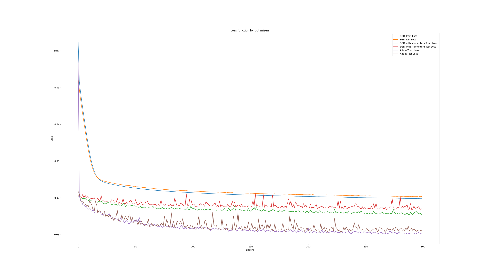

Z grafu vidíme, že model sa učí a zlepšuje svoju úspešnosť. Najlepšie výsledky dosahuje optimalizačný algoritmus `Adam`, ktorý dosahuje najnižšiu chybu na trénovacej aj testovacej množine. Naopak najhoršie výsledky dosahuje optimalizačný algoritmus `SGD`. 

Používal som iba jednu skrytú vrstvu, pretože počas experimentovania som zistil, že pridanie ďalšej skrytej vrstvy mi iba zhoršilo výsledky.

Mám implementovaný aj mechanizmus na skoršie zastavenie trénovania. Trénovanie skončí ak hodnota loss funkcie bude menšia ako 0.01 a následne sa po 10 epochách ukončí trénovanie. Tento mechanizmus ale pri 300 epochách nie je v podstate nikdy použitý, pretože ak model dosiahne danú hodnotu loss funkcie, tak trénovanie aj tak skončí.

## Podúloha č.2

### Opis problému

Našou úlohou je implementovať algoritmus backpropagation. Neurónová sieť (v tomto prípade MLP) sa učí pomocou minimalizácie zadanej chybovej funkcie. Je  treba implementovať doprednú aj spätnú časť a funkcie na aktualizáciu parametrov siete.

### Implementácia

Na implementáciu som použil rovnaké nástroje ako v prvej podúlohe.
Jediný rozdiel je v použitých knižniciach, kde mi stačili iba `numpy` a `matplotlib`.

### Opis riešenia

Neurónová sieť obsahuje vstupnú vrstvu, 1 alebo 2 skryté vrstvy a výstupnú vrstvu. Používa 3 aktivačné funkcie: `Sigmoid`, `Tanh` a `ReLU`. Tieto parametre sa nastavujú na základe výberu používateľa. 

Program funguje nasledovne:
Najskôr používateľ zadá potrebné parametre modelu, z vopred definovaných datasetov sa vyberie jeden a následne sa model natrénuje. Vždy nový model sa natrénuje pre všetky datasety. Po natrénovaní sa vykreslia grafy, ktoré zobrazujú chybu modelov a vypíšu sa výsledné hodnoty loss funkcií do konzole.

Trénovanie modelu prebieha nasledovne:
Dáta prejdú doprednou časťou siete, násldne sa vypočíta chyba pomocou loss funkcie (v tomto prípade `MSE`). A potom sa vypočíta gradient pomocou backpropagation. Toto sa opakuje na daný počet epochov.

Opis backpropagation algoritmu v skratke:
Keď sa vypočíta chyba (loss) tak sa pomocou derivácií a transponovaných matíc a násobením daných matíc prepočítava váha a bias pre každú vrstvu pričom môže byť použitý aj `moment`.

### Testovanie a záver

**Grafy z viacerých experimentov:**

Pre konzistenciu som vždy používal počet epoch 500.

*Poznámka: Moment 0.0 znamená, že sa nepoužíva.*

| Aktivačná funkcia | Learning rate | Moment | Počet skrytých vrstiev |
|--------------------|---------------|----------| --------------|
| Sigmoid            | 0.1          | 0.0      | 1             |

| Problém | Final Loss |
|---------|---------------|
| XOR     | 0.2493912523687859        |
| AND     | 0.1458210362951525        |
| OR      | 0.1623939578860812        |

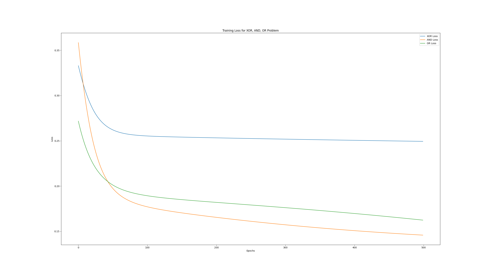

| Aktivačná funkcia | Learning rate | Moment | Počet skrytých vrstiev |
|--------------------|---------------|----------| --------------|
| Sigmoid            | 0.1          | 0.5      | 1             |

| Problém | Final Loss |
|---------|---------------|
| XOR     | 0.24980253348366271        |
| AND     | 0.16418168056911003        |
| OR      | 0.048362607148484935        |

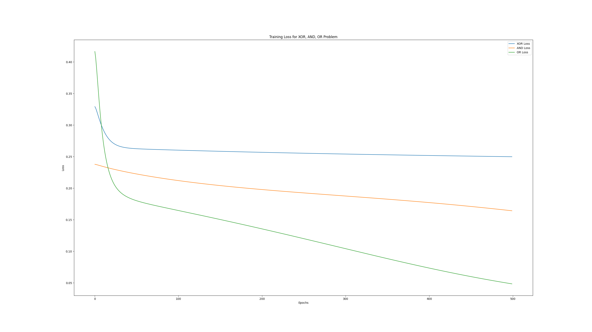


| Aktivačná funkcia | Learning rate | Moment | Počet skrytých vrstiev |
|--------------------|---------------|----------| --------------|
| Tanh            | 0.1          | 0.0      | 1             |

| Problém | Final Loss |
|---------|---------------|
| XOR     |     0.003568440985928073    |
| AND     |     0.0016973666759365277    |
| OR      |     3.192157965050692e-05    |

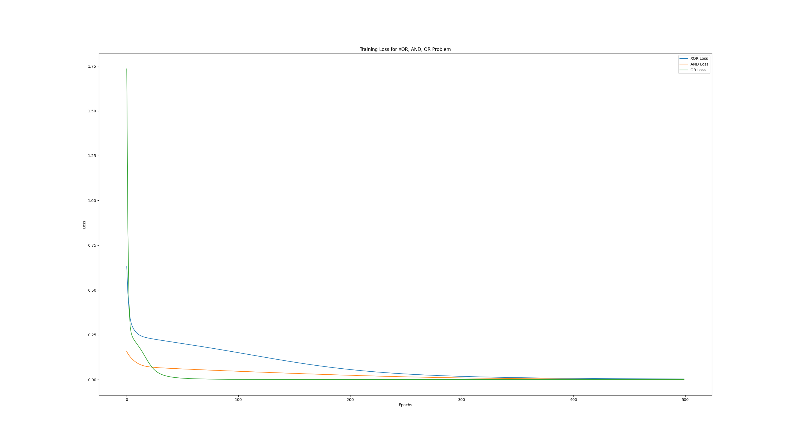

| Aktivačná funkcia | Learning rate | Moment | Počet skrytých vrstiev |
|--------------------|---------------|----------| --------------|
| Tanh            | 0.1          | 0.5      | 1             |

| Problém | Final Loss |
|---------|---------------|
| XOR     |     0.00026369882628429596    |
| AND     |    0.0003099187557216563     |
| OR      |     4.949392306815931e-06    |

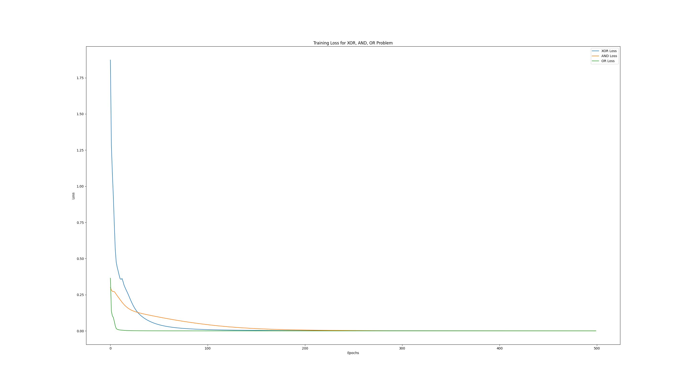


| Aktivačná funkcia | Learning rate | Moment | Počet skrytých vrstiev |
|--------------------|---------------|----------| --------------|
| ReLU            | 0.1          | 0.0      | 1             |

| Problém | Final Loss |
|---------|---------------|
| XOR     |    0.25     |
| AND     |      1.259189733169842e-10   |
| OR      |     0.75    |

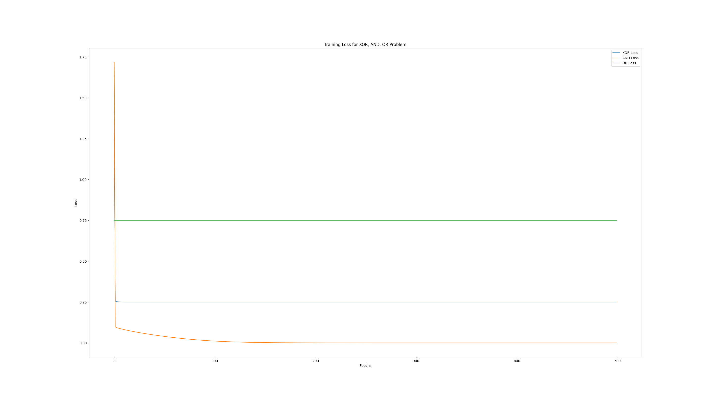

| Aktivačná funkcia | Learning rate | Moment | Počet skrytých vrstiev |
|--------------------|---------------|----------| --------------|
| ReLU            | 0.1          | 0.5      | 1             |

| Problém | Final Loss |
|---------|---------------|
| XOR     |      0.25   |
| AND     |       0.25  |
| OR      |       0.75  |

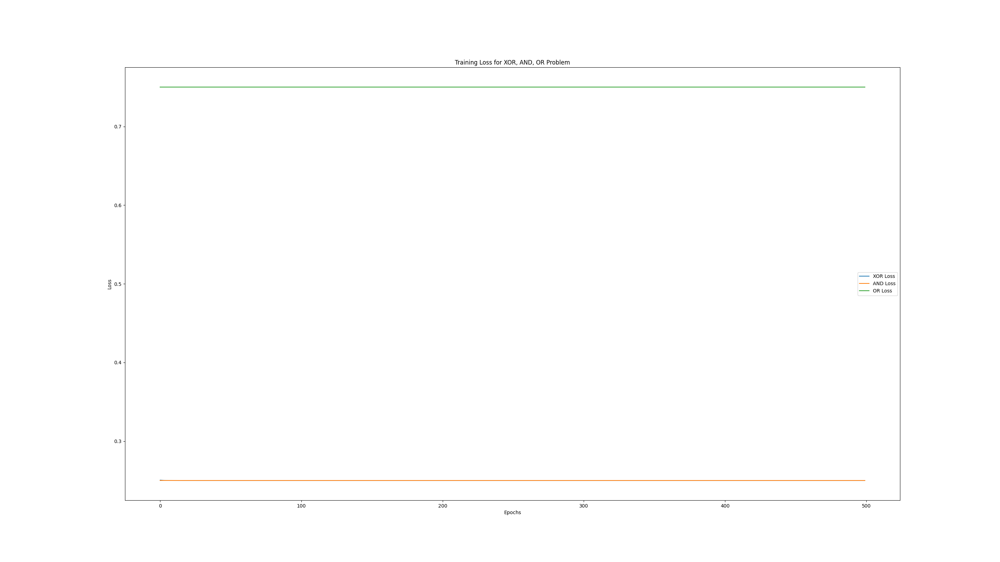


Keďže pri 1 vrstve na tom najlepšie bola aktivačná funkcia `Tanh`, tak som na 2 vrste použil túto aktivačnú funkciu ale zasa som použil iné hodnoty pre `momentum` a `learning rate`.

| Aktivačná funkcia | Learning rate | Moment | Počet skrytých vrstiev |
|--------------------|---------------|----------| --------------|
| Tanh            | 0.1          | 0.0      | 2             |

| Problém | Final Loss |
|---------|---------------|
| XOR     |     0.00820080124344644    |
| AND     |    0.00020989853136868213     |
| OR      |     0.0030716619329251484    |

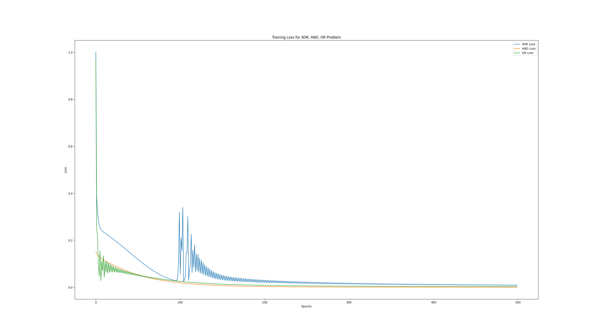

| Aktivačná funkcia | Learning rate | Moment | Počet skrytých vrstiev |
|--------------------|---------------|----------| --------------|
| Tanh            | 0.01          | 0.0      | 2             |

| Problém | Final Loss |
|---------|---------------|
| XOR     |    0.007352669105828195     |
| AND     |     0.0035546991121778258    |
| OR      |    0.00021684694704532655     |

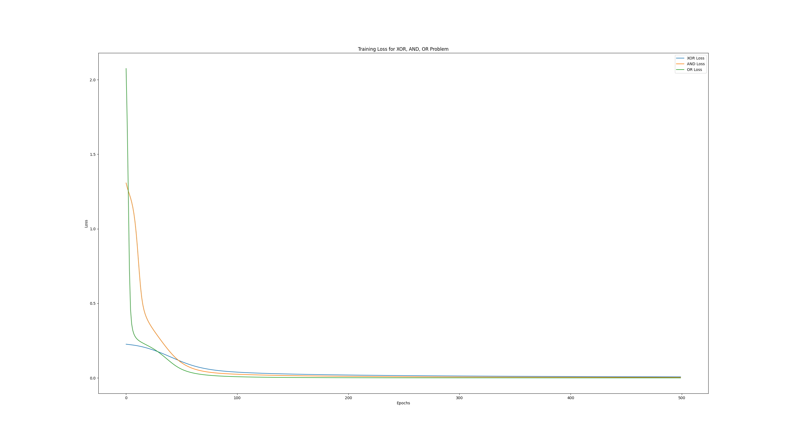

| Aktivačná funkcia | Learning rate | Moment | Počet skrytých vrstiev |
|--------------------|---------------|----------| --------------|
| Tanh            | 0.1          | 0.5      | 2             |

| Problém | Final Loss |
|---------|---------------|
| XOR     |   1.730485231879896e-05      |
| AND     |    3.173818880869649e-05     |
| OR      |     5.446947926394045e-06    |

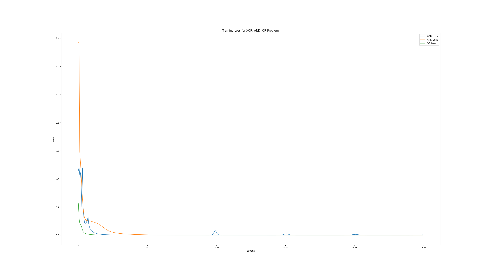

| Aktivačná funkcia | Learning rate | Moment | Počet skrytých vrstiev |
|--------------------|---------------|----------| --------------|
| Tanh            | 0.01          | 0.5      | 2             |

| Problém | Final Loss |
|---------|---------------|
| XOR     |     0.16181373125811305    |
| AND     |    0.0106067679161355     |
| OR      |     7.651225714748267e-05    |

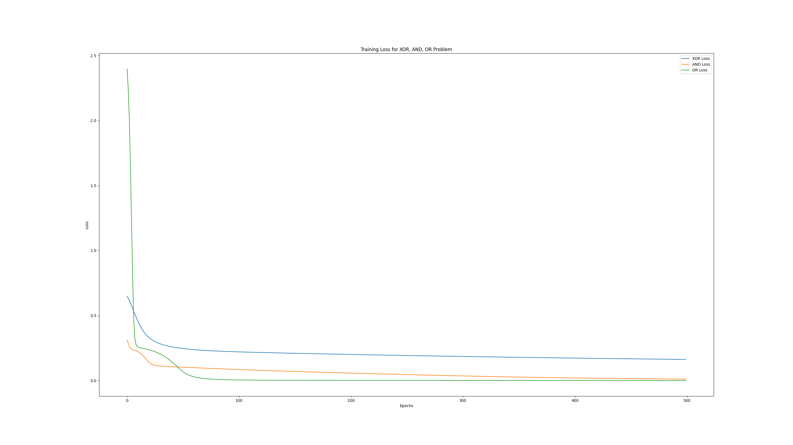


Na záver môžeme povedať, že najlepšie výsledky pre problém XOR dosahujeme pri použití aktivačnej funkcie `Tanh` s parametramy `learning rate` 0.1 a `momentum` 0.5 s 2 skrytými vrstvami.

## Zdroje

- Prednášky z predmetu UI (Umelá inteligencia)
- [Stránka predmetu UI](http://www2.fiit.stuba.sk/~kapustik/UNSb.html)
- [California Housing Prices dataset](https://inria.github.io/scikit-learn-mooc/python_scripts/datasets_california_housing.html)
- [Pytorch dokumentácia](https://pytorch.org/tutorials/beginner/basics/buildmodel_tutorial.html)
- [NumPy dokumentácia](https://numpy.org/doc/stable/reference/index.html)
- [MLP from scratch](https://elcaiseri.medium.com/building-a-multi-layer-perceptron-from-scratch-with-numpy-e4cee82ab06d)
- [Momentum explainer](https://datascience.stackexchange.com/questions/84167/what-is-momentum-in-neural-network)